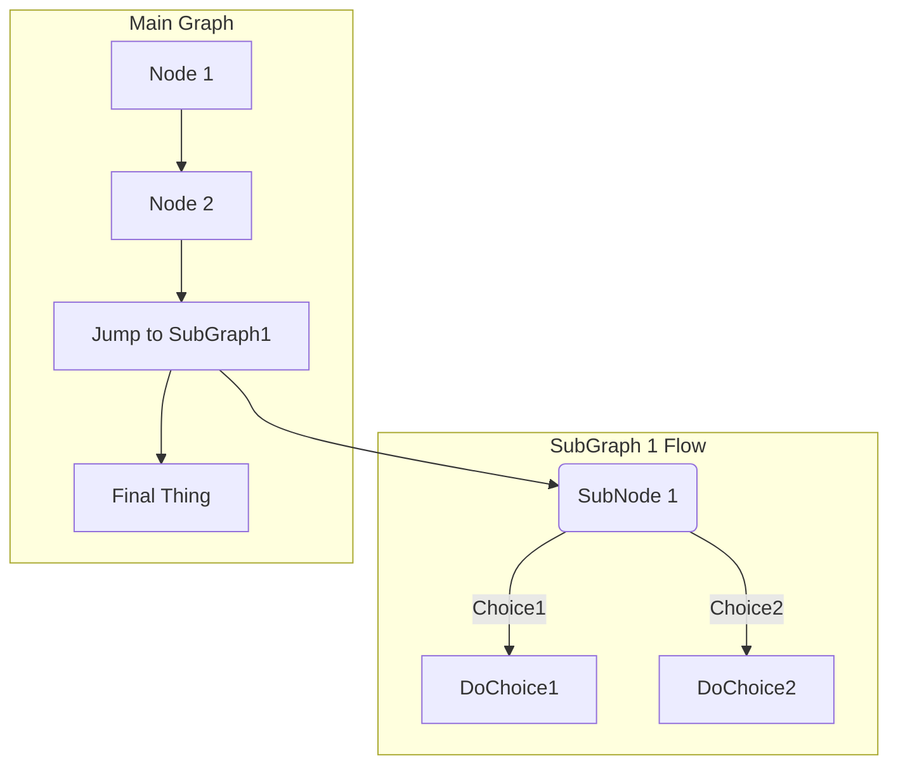

# markdown_check
# GitLab Flavored Markdown (GLFM)
## Table of content 
[TOC]

## Line Breaks
Here's a line for us to start with.

This longer line is separated from the one above by two newlines, so it is a *separate paragraph*.

This line is also a separate paragraph, but...
These lines are only separated by single newlines,
so they *do not break* and just follow the previous lines
in the *same paragraph*.

## Emphasis
Emphasis, or italics, with *asterisks* or _underscores_.

Strong emphasis, or bold, with double **asterisks** or __underscores__.

Combined emphasis with **asterisks and _underscores_**.

Strikethrough with double tildes. ~~Scratch this.~~


### Multiple underscores in words and mid-word emphasis
perform_complicated_task

do_this_and_do_that_and_another_thing

but_emphasis is_desired _here_


## Inline diff
- {+ addition 1 +}
- [+ addition 2 +]
- {- deletion 3 -}
- [- deletion 4 -]
- {+ Just regular text +}
- {+ Text with `backticks` inside +}
- {+ Text with escaped \`backticks\` inside +}

## Headings
# H1
## H2
### H3
#### H4
##### H5
###### H6

## Links
- This line shows an [inline-style link anything you type here will be link](https://www.google.com)
- This line shows a [link to a repository file in the same directory](permissions.md)
- This line shows a [relative link to a file one directory higher](../index.md)
- This line shows a [link that also has title text](https://www.google.com "This link takes you to Google!")


Using references:

- This line shows a [reference-style link, see below][Arbitrary case-insensitive reference text]
- You can [use numbers for reference-style link definitions, see below][1] 
- Or leave it empty and use the [link text itself github][], see below.  


[arbitrary case-insensitive reference text]: https://www.mozilla.org/en-US/
[1]: https://slashdot.org
[link text itself github]: https://about.gitlab.com/
[2]: https://prastut.com

## Auto-linking
- https://www.google.com
- https://www.google.com
- ftp://ftp.us.debian.org/debian/
- smb://foo/bar/baz
- irc://irc.freenode.net/
- http://localhost:3000


## Multimedia 
### Images
<!-- inline style -->

Fig: inline-styled photo
<!-- Reference-style -->
![alt text1][logo]

[logo]: markdown_logo.png "Title Text"
Fig: referenced-styled photo


### Videos

<!-- <video controls src="markdown_video.mp4" title="Title"></video> -->

### Audios

<!-- <audio controls src="markdown_audio.mp3" title="Title"></audio> -->

## Lists
1. First line
2. Second line
    - unorder sub-list.
3. Countinue
    3. but it's just a number 

- use
* asteriks
+ plues

- Unordered list item this is good 

  5. First ordered list item

- Unordered list item this is bad
  5. First ordered list item


## Task list
- [ ] Completed task
- [~] Inapplicable task: this could be cut 
- [x] Incomplete task
  - [x] Sub-task 1
  - [~] Sub-task 2
  - [x] Sub-task 3

1. [ ] Completed task
1. [~] Inapplicable task
1. [ ] Incomplete task
   1. [ ] Sub-task 1
   1. [~] Sub-task 2
   1. [ ] Sub-task 3


## Blockquotes
> Blockquotes help you emulate reply text.
> wow, I like this one. 

Quote break.

> This very long line is still quoted properly when it wraps. Keep writing to make sure this line is long enough to actually wrap for everyone. You can also *use* **Markdown** in a blockquote. **_use_**

### Multiline blockquote
>>>
If you paste a message from somewhere else

that spans multiple lines,

you can quote that without having to manually prepend `>` to every line!

But this is not showing in preview in vscode. 
>>>

## Code spans and blocks 
Inline 'code' has `back-ticks` aroung it. 

we can use:
```python 
def fun():
    print('This block is created by markdonw')
```

~~~
also tildes could be used
~~~


### Diagrams and flowcharts 





## Maths
This math is inline: $`a^2+b^2=c^2`$.

This math is on a separate line using a ```` ```math ```` block:

```math
a^2+b^2=c^2
```

This math is on a separate line using inline `$$`: $$a^2+b^2=c^2$$

This math is on a separate line using a `$$...$$` block:

$$
a^2+b^2=c^2
$$


## Tables 
| header 1 | header 2 | header 3 |
| ---      | ---      | ---      |
| cell 1   | cell 2   | cell 3   |
| cell 4 | cell 5 is longer | cell 6 is much longer than the others, but that's ok. It eventually wraps the text when the cell is too large for the display size. |
| cell 7   |          | cell 9   |


| Prastut | Bhattarai |
| --- | --- |

### Alignment 
| Left Aligned | Centered | Right Aligned |
| :---         | :---:    | ---:          |
| Cell 1       | Cell 2   | Cell 3        |
| Cell 4       | Cell 5   | Cell 6        |

### Cells with multiple lines
| Name | Details |
| ---  | ---     |
| Item1 | This text is on one line |
| Item2 | This item has:<br>- Multiple items<br>- That we want listed separately |


| header 1 | header 2 |
| ---      | ---      |
| cell 1   | cell 2   |
| cell 3   | <ul><li> - [ ] Task one </li><li> - [ ] Task two </li></ul> <br> - [ ] checklist for you this wont work .
| Task | Status |
| Item 1 | <input type="checkbox"> |
| Item 2 | <input type="checkbox" checked> |


## Copy paste from a spreadsheet 
paste here:


## Json Table 
```json:table
{
  "items": [
    { "fruit": "apple", "1 kg": 20, "2 kg": 50 },
    { "fruit": "banana", "1 kg": 20, "2 kg": 50 }
  ]
}
```


## Colors 
You can write a color code in the formats: HEX, RGB, or HSL.
- `#FF0000AA`
- `RGB(0,255,0)`

## Emoji 

:monkey:
:star2:
:speech_balloon:
:zap: 
:v:
:bug: 
:speak_no_evil: 
:snail: :birthday:
:heart: 
:fearful::family:


## Front Matter 
- Yaml (---):

--- 
title: About my front
example: 
    language: yaml
---

+++
title = "About Front Matter"
[example]
language = "toml"
+++


;;;
{
  "title": "About Front Matter"
  "example": {
    "language": "json"
  }
}
;;;

---php
$title = "About Front Matter";
$example = array(
  'language' => "php",
);
---

## Escape characters 


>>>! " # $ % & ' ( ) * + , - . / : ; < = > ? @ [ \ ] ^ _ ` { | } ~


\# Not a heading

| Food            | Do you like this food? (circle) |
|-----------------|---------------------------------|
|  Pizza          |  Yes \| No                      |


\**Not bold, just italic text placed between some asterisks*\*

## Footnotes 
A footnote reference tag looks like this: [^1]

This reference tag is a mix of letters and numbers. [^footnote-42]

[^1]: Here is your link for followup

[^footnote-42]: This text is another footnote.

## Horizontal rule
---

***

___


## Inline Html 

<dl>
  <dt>Definition list</dt>
  <dd>Is something people use sometimes.</dd>

  <dt>Markdown in HTML</dt>
  <dd>Does *not* work **very** well. HTML <em>tags</em> do <b>work</b>, in most cases.</dd>
</dl>


## Collapsible section 
<details>
<summary>Click to expand</summary>

These details <em>remain</em> <strong>hidden</strong> until expanded.

<pre><code>PASTE LOGS HERE</code></pre>
<pre><code>PASTE LOGS HERE</code></pre>
<pre><code>PASTE LOGS HERE</code></pre>

</details>


## Keybord HTML tag 
Press <kbd>Enter</kbd> to go to the next page.


## Superscripts/ Subscripts 
The formula for water is H<sub>2</sub>O
while the equation for the theory of relativity is E = mc<sup>2</sup>.

## Wiki Link 
[Link to Documentation](documentation)
[Link to File](file.md)
[Link to Related Page](../main)
[Link to Related Page Root](/documentation)

## GitLab-specific references
@prastut
@all 


